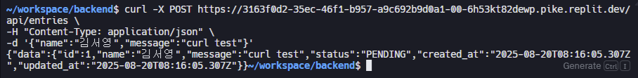
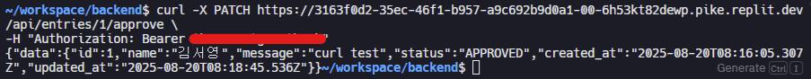
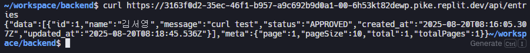
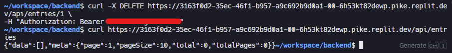
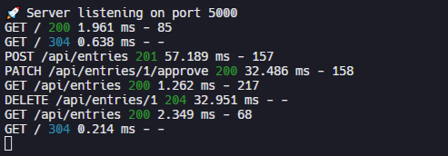

# Guestbook Backend

## 소개
`Guestbook`은 관리자 승인 기능이 추가된 방명록 서비스입니다.
- Node.js + Express 기반 REST API  
- SQLite3 데이터베이스 사용  
- 관리자 인증 기능 포함 (글 승인/거절/삭제)

프론트엔드와 연동하면 실제 웹에서 방명록을 작성하고, 승인/거절을 관리할 수 있습니다.
FE GIT >> 

---

## 기능

1. **글 작성** (`POST /api/entries`)  
   - 이름, 메시지 입력 → `PENDING` 상태로 저장  
2. **글 조회** (`GET /api/entries`)  
   - `APPROVED` 글 기본 조회  
   - 관리자 모드에서는 `PENDING` 글 조회 가능  
   - 검색, 페이지네이션 지원  
3. **글 승인** (`PATCH /api/entries/:id/approve`) — 관리자 전용  
4. **글 거절** (`PATCH /api/entries/:id/reject`) — 관리자 전용  
5. **글 삭제** (`DELETE /api/entries/:id`) — 관리자 전용  

---

## 설치 및 실행

```bash
# 저장소 클론
git clone https://github.com/ae-spa/guestbook-backend.git
cd guestbook-backend

# 의존성 설치
npm install

# 환경변수 설정
export ADMIN_TOKEN=관리자토큰
```
---

## 주의사항

- 현재 프론트엔드가 서버를 실행했음에도 일부 환경에서 접속이 원활하지 않습니다.
- 이전에는 데이터베이스에 글이 정상적으로 저장되었으나, 최근 수정 과정에서 일부 글 저장 기능이 제대로 동작하지 않습니다.
- 가끔 새로고침 시 글이 저장되지 않고 초기 상태로 돌아가는 현상이 발생합니다.

---

## 스크린샷

**글 작성 (POST → PENDING)**



**글 승인 (PATCH → 관리자인증)**



**글 목록 조회 (GET → APPROVED 글만)**



**글 삭제 조회 (DELETE → 관리자인증)**



**콘솔 로그**




